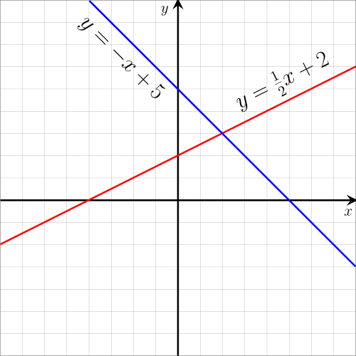

# Equations - Linear Equations

There are tons of equations and one of them is the **linear equation**.
A linear equation is an equation of the type  where:

- a and b are numbers;
- a cannot be zero;
- x has no exponents;
- x should be the only variables other than y.

These equations are called 'linear' because when you graph them, you end up with a single line.

Source: Wikipedia (https://en.wikipedia.org/wiki/Linear_equation)
